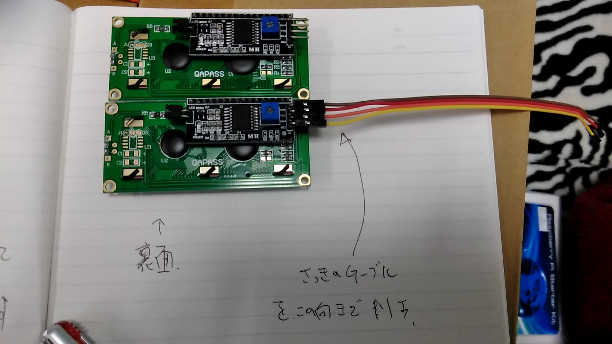

# Raspberry Pi 実習
## はじめに
Raspberry Pi とは, 英国のラズベリーパイ財団によって開発されている教育用シングルボードコンピュータです.  
この基板一枚で, コンピュータとして動作します.
コンピュータのアーキテクチャとしては, 一般的なPCのAMD64やx86ではなく, スマートフォン等でよく採用されているARMアーキテクチャですから, 一般的なPC向けの実行バイナリは動作しません.  
しかしながら, ARM向けのCコンパイラ等はよく整備されているので, ソースビルドが可能なものに関しては動作し, 多くのことができます.  
Raspberry Pi向けのOSとして,  

- Windows 10 IoT
- Raspbian(debianベース, linux)
- Ubuntu
- Gentoo Linux
- CentOS
- ChromiumOS

等があります. これらはすべて無償です.
今回の実習では, Raspbianから, デスクトップ環境を取り除き, 204教室向けのセットアップを済ませたもので行います. こだわりがある方は, ご自分でSDカードを焼き直していただいて結構です.

Raspberry Piは, デスクトップ環境を動作させるだけの性能と, 画面出力を保有しているので, 画面にGUIを表示させてマウスを用いた操作をすることが可能ですが, 今回はSSH接続によって, CLIから操作します.

## 箱から出す前に
### 配布物のチェック
- シール1枚
- 紙箱1つ
- プラ箱1つ
- microSDカード

**紙箱とプラ箱のナンバリングが一致していることを確認してください.**  
気をつけていても内容物が混ざるので, 紛失防止のために「どちらかの箱には入っている」という状況にしておいてください.

授業修了後に回収します. MicroSDは挿したままで構いません.
MicroSDのケースは紙箱に入れておいてください.

### Raspberry PI を壊さないために
実習用なので, 事故等で壊しても構わないのですが, なるべく壊さないほうが良いです.  
どうやると壊れるか？は知っておきましょう. **以下はやらないでください!!**

以下のピンを短絡すると壊れます.

- 3.3V, 5Vの電源, GNDのうち, いずれか異種2つ以上.
- (Push-Pull: 普通の出力の)出力ピンと, 3.3V/5Vの電源, GND, 出力ピン(Push-pull, Open-Drain)
- Open-Drain出力と, 電源
- 極性の異なるOpen-Drain出力 (後述のI2Cは極性が一緒なので大丈夫)

また, 3.3Vを超える電圧, 0Vを下回る電圧をピンにかけると, 壊れる可能性があります.

精密機器なので, 静電気で壊れます.

## 組立
### Raspberry Pi本体と付属液晶の接続
紙箱からラズベリーパイ本体, プラ箱からジャック−ジャックのケーブル (黄橙赤茶黒白灰紫) , キャラクタ液晶を取り出します. ケーブルはジャック−ジャックであればどちらでも構いませんが, 説明のため 黄橙赤茶黒白灰紫 のものとします. 

ケースにGPIOシールを写真の向きで貼ります.

ケーブルを4本-4本に裂いて分割します.

| 裂く前 | 裂いた後|
|:---:|:---:|
|||

袋から液晶を取り出し, ケーブルを接続します.

|||
|:---:|:---:|
|||

Raspberry Piのケース端子カバーを外します. 爪を傷めないように注意.

|10円玉を使うと良い|側面から|
|:---:|:---:|
|||

ケーブルの反対側を, Raspberry Piに接続します.

Raspberry Pi本体と, キット付属のキャラクタ液晶を, ケーブルで接続します. 
ケーブルの接続は,

|Raspberry Pi|Rpiピン番号|液晶|ケーブルの色|
|:---:|:---:|:---:|:---:|
|GND|4|GND|茶|
|5V|6|VCC|赤|
|I2C_DATA/GPIO2|3|SDA|橙|
|I2C_CLK/GPIO3|5|SCL|黄|

です. ピン同士が正しく結線されているのであれば, ケーブルの色はこの組み合わせでなくても問題ありません.

5V, GNDは, そう表記されているピンならどこにつないでも動作します.

**VCC, GNDを逆接続すると壊れるので注意.**

### MicroSDカードのセット
Raspberry Piの下部にMicroSDスロットが存在するので, 付属のMicroSDカードを刺します.
MicroSDは, 本講義用にセットアップ済なので, ネットワークの設定等の必要はありません.

### LANケーブルの接続
付属のLANケーブル, ないしは貸出のLANケーブルを用いて, 204室のLANに接続します.

### 電源USBケーブルの接続
付属のスイッチつきUSBケーブルと, USB-ACアダプタを用いて, Raspberry PIを通電させます.

これで組立は完了です. 液晶が暗い, 明るすぎる場合は液晶裏の電子部品のプラスネジを回し, それでも暗い場合, あるいは表示されない場合は接続を確認してください.  

## ログイン
液晶画面の上段にipアドレス, 下段にパスワードが表示されているはずなので,  
`$ ssh pi@192.168.1.なんとか`
とすると, パスワードが要求されるので、下段のパスワードを打ち込んでください.  
ログインすると, この液晶画面の表示は消えます.

これはオリジナルの実装であり,  /usr/local/bin/にpythonで書かれたスクリプトが入っていて, /etc/rc.local (起動時に読みこまれる) で実行するように書いてあります.

このパスワードは, 起動するたびに変わるように設定してあるに過ぎないので, 
[前回の講義資料](https://github.com/utmsks/KSImaterial/blob/master/contents/network/ssh.md) を参考にしつつ, 公開鍵を登録し, パスワード認証を不可にするとよいでしょう. (任意)  
パスワードは資料を読みながら作業していれば既に忘れているはずなので, scpせずに, PCのid_rsa.pubの中身を,  
`pi@192.168.1.なんとか$ echo id_rsa.pubの中身 >> ~/ssh/authorized_keys`  
すれば公開鍵の登録はできます. 適当なエディタで直接書いても良いでしょう.

もしsshが繋がらないようであれば, PC側のknown_hostsから192.168.1.Xとなっているものを全部削除しましょう. sshクライアントはアドレスと相手の実体の組を記憶しているので, 「訪ねたら違う相手が出てきた.」　はエラーとして処理します.

## 色々つないでみる.
プラスチック箱のほうのキットに[マニュアル](http://osoyoo.com/ja/2017/10/09/raspberry-pi-starter-kit-v1-introduction/)が付随しているので, それを参考に色々と遊んでみてください. ただし,  

 - i2c関係のセットアップは完了しています.
 - マニュアルはpython2で書かれていますが, 可能ならpython3で書いて欲しいです. OS標準のPythonインタプリタはpython2なので, `$ python3 foo.py` と実行時は打ってください..
 - キットにジャック-プラグのケーブルは付属していないので, 必要になったらジャック-ジャックのケーブルとプラグ-プラグのケーブルを繋げて用意してください.
 - ラズパイのGUI環境は用意していないので, 説明書きに***美しい画面***が出ていたら, MethodBと書いてあるところまで読み飛ばしてください.
 - 折角つないだ液晶ですが, もう外してしまっても構いません.  
    - 大抵の場合, 再起動しても同じIPアドレスが振られるはずですが. ダメなときは液晶をつなぎ直してください.
 - 怪我等しないように注意をおねがいします.
 - 一部部品ははんだ付けが必要です. (コンプリートするには必須, 実習課題としては任意.)

 
 

 マニュアルへのリンクは[こちら](http://osoyoo.com/ja/2017/10/09/raspberry-pi-starter-kit-v1-introduction/).

## 色々な規格の説明.
詳細は自分で調べてほしいのですが, 大雑把に書いておきます. 

### GPIO
General-purpose input/output のこと, すなわち, 汎用の入出力ピンを指します.  
プログラムによって制御でき, 

- 入力モード (ピンの電圧を監視する)
    - Hi Z (ハイインピーダンス)
        - つないでる先に影響を与えないように, なるべく電流の出入りがないように読み取る.
    - プルアップ/プルダウン
        - 開放されたときにHighあるいはLowで安定するように, 抵抗を介してVCCあるいはGNDに接続している.
        - スイッチなどの読み取りに便利  
- 出力モード（ピンに電圧を出力する）
    - プッシュプル
        - ピンを0V=GNDに直結する(Low)か, 電源電圧=3.3V=VCCに直結する(High)
    - オープンコレクタ/ドレイン
        - ピンを0V=GNDに直結する(Low)か, ピンを内部でどこにも接続しない(High)かする.
        - 3.3V=VCCに直結する(High)ものもある.
        - プルアップ/プルダウンすることが可能なものもある.

などの動作ができます.
GPIOはLow/Highの値を読み出すことができ, HighまたはLowを, 直結あるいは抵抗経由で出力することができます. 状態は多いが基本デジタルです.

### A/Dコンバータ(Analog in)
アナログ入力. たしかラズパイにはついていなかったと思います. 
入力電圧を, 最低電圧(一般にGND=0V), 最高電圧(一般にVCCあるいは1.024V)の間で適当な分解能(10bitなどが多い)で測定し, 整数値として得ることができます.
ノイズが乗りやすいので, 読み出しには色々とコツがいります.

### D/Aコンバータ(Analog out)
アナログ出力. 整数値を受け取って, 適当な電圧を出力します. これもラズパイにはついてないはずです.

### PWM
矩形波のHighとLowの比率を変える変調方式. LEDの調光や, 擬似的なアナログ出力として用いられます.
付属のサーボモーターはPWMで制御信号を送るようになっています. (これは比率じゃなくて単純に幅ですが) 

### UART
基本中の基本の通信規格.
UART, USART, Serial等色々表記はありますが, これらは大抵一緒のものです.

TX, RXの2本の線で通信ができます（実際はGNDを結合する必要があり, 最低3本).
比較的高速ですが, 非常に低レベルであり, アドレス等の概念を持ちません.
また, クロックを共有していないため, 動作周波数の精度が悪いと通信エラーを起こします.

最近はそこまで目立って用いられていませんが, シリアルポートで用いられるRS-232は論理レベルでは同等のものです. (ただし, 電圧が違うので直接接続しても動作しません）

### I^2C (IIC)
Inter-Integrated Circuit のこと. アイツーシー, アイスクエアードシー　などと読まれます. 決してアイアイシーとは読まれません.

抵抗でプルアップされた2本の信号線(DATA, CLK)を用いて, 多数の部品間の通信をすることができます.

電気的な説明は省きます.  
Master/Slave の区別のある通信バスで, 各素子はアドレスによって管理されます.  
通信は常にMaster側から行われる. すなわち, SlaveからMasterに送信するのは, Master側から要求があったときに限られます.

通信は遅いので, あまり大容量のデータのやり取りには向きません.

今回のキットでは圧力センサ、液晶画面などがI2Cでの接続です.

### SPI
Serial Peripheral Interface のこと. どっかの不思議な試験のことではありません.  
I2C同様, 多数の部品間の通信ができます. これは機器アドレスを通信で定めずに, 通信相手指定用の信号線をSlaveの数だけ持ちます.

SDメモリーカードが対応しています. 通信は遅いのであまり大容量のデータのやり取りには向きませんが, SDメモリーカードに気軽に書き込めると重宝されています.

- SCK (Serial Clock)
- MISO (Master IN Slave OUT)
- MOSI (Master OUT Slave IN)

の3本が共有線としてあり, Slave機器ごとに

- SS (Slave Select)

が1本ずつ割り当てられます.

今回のキットでは, A/Dコンバータ　(単にADCと書くことが多い) がSPI接続です.

## 色々なアイディア

Raspberry PIは要するにセンサが直結できるLinuxである.
したがって, 
入出力に

 - ネットワーク (WebServer等)
 - カメラ

等が利用できます.  
また, それなりの処理能力を持っているから, 

 - 簡単な画像処理 (物体検知等)
 - そこそこの計算

 等もできます.
 
 WebServerを作るのであれば, python+flaskが簡単です. 凝ったことするのであればpython+djangoがお勧めです.  
 物体検知とかやるのであれば, とりあえずはOpenCVでやるのがよいと思います.
 
 通電時にアプリケーションを起動するなどといったことは, 比較的簡単にできます.
 
### 余談
Raspberry PI が不得手とするような処理も沢山あるので, 「IoT機器を作る際はRaspberry PIですべて解決しよう！」だなんて発想はしないほうが良いです. Arduinoなど, 組み込み向けマイコンでパパっと作れるものが, 開発に数日にかかってしまうこともあるし, 秋葉原で200円で買えるようなマイコンと, 一台4000円程度するRaspberry PIでは壊してしまったときの損害が全然違います. Raspberry PIは非常に強力な土台ではあるからこそ, それにあった使い方をするべきです.

## 作例

Raspberry PI を使って

- 顔認証式のスマートロック
    - 泥棒に入られても困るので, もし実用するのであれば自己責任でお願いします.
- 部屋の温度・湿度・二酸化炭素濃度を監視し, インターネット経由で時間指定をすることで, その時間に快適な環境になるよう空調を切り替えるスマートリモコン 
    - 火事になっても困るので, もし実用するのであれば自己責任でお願いします.

なんてものは多分実装できます. 

## オマケ

RAの土屋が加速度センサとか持ち歩いているかも…？